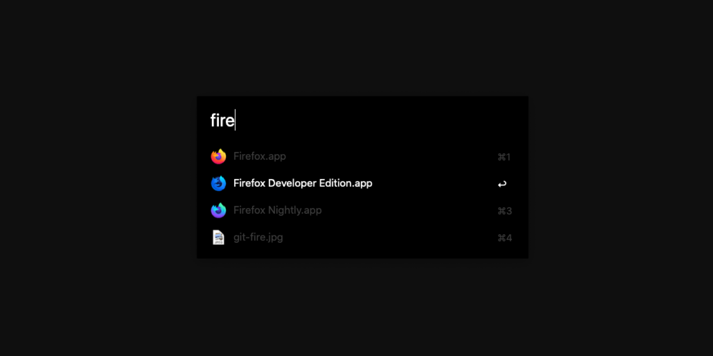

<em>Matte black UI and syntax dark themes for replicants</em>

## Intro

**Deckard** is a collection of user interface and syntax themes for web and MacOS applications. Currently for [Alfred](#alfred) and more to come.

## Alfred

### Install

1. Git clone this repository
2. Open the _deckard_ folder, and double-click `deckard.alfredappearance`

## License

[MIT][license] © [Danny de Vries][author]

[author]: https://github.com/dandevri
[license]: license
