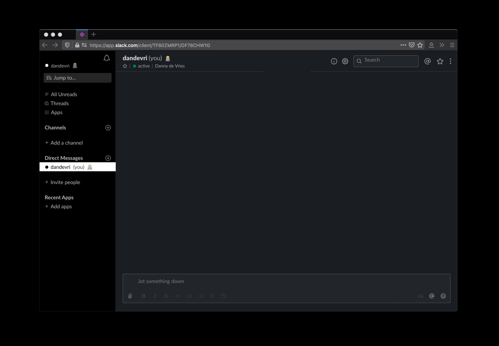

<div align="center" style="text-align: center;">


<em>Matte black UI and syntax dark themes for replicants</em>

<a href="#alfred">Alfred</a> |
<a href="#slack">Slack</a> 

</div>

## Intro

**Deckard** is a collection of user interface and syntax themes for web and MacOS applications. 

## Alfred


### Install

1. Git clone this repository
2. Open the _deckard_ folder, and double-click `deckard.alfredappearance`

## Slack


### Install

1. Navigate to `preferences` (click _workspace_ name in the top)
2. Select `themes` in the sidebar
3. Paste the following values at the bottom of the page:

```
#000000,#000000,#FFFFFF,#000000,#000000,#FFFFFF,#FFFFFF,#FFFFFF
```

## Support

I believe in making resources and products public and free (as in freedom, not free as in free frappuccinos) so people can build upon them. If you like my resources and products you can consider [supporting me][support].

Made with 🤍 by [Danny de Vries][author] and [contributors][contributors].

## License

[MIT][license] © [Danny de Vries][author]

[author]: https://github.com/dandevri
[license]: license
[contributors]: https://github.com/voightco/deckard/graphs/contributors
[support]: https://www.dandevri.es/support/
